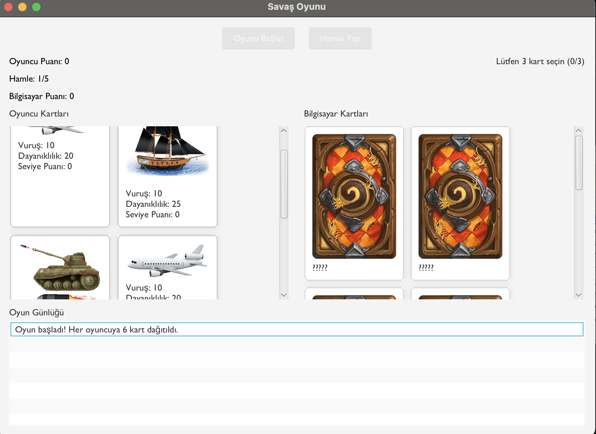
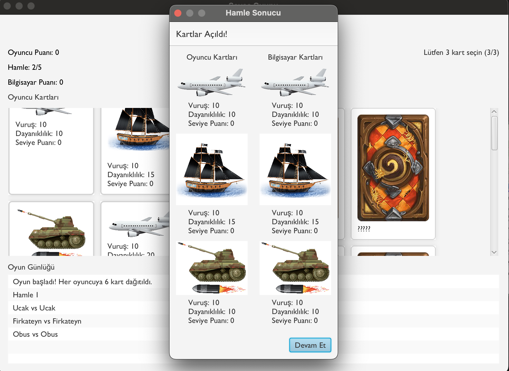
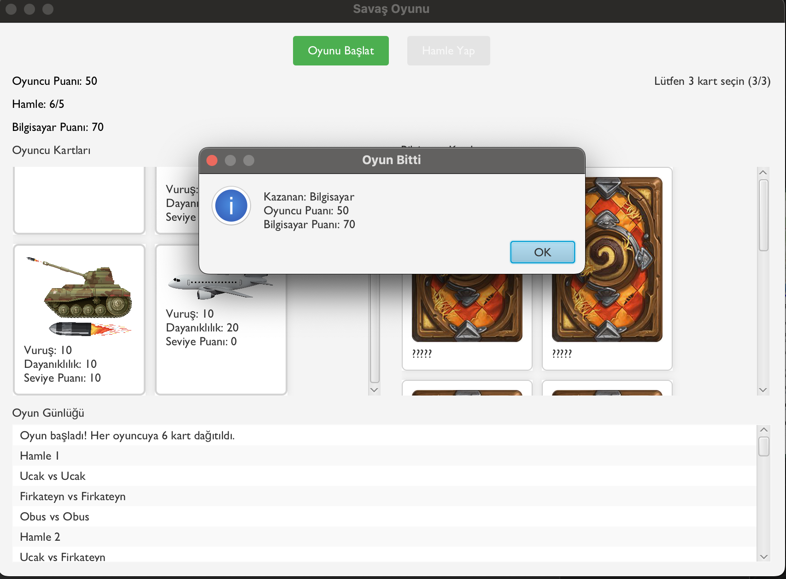

# ⚔️ Savaş Araçları Kart Oyunu – PROLAB Güz Dönemi Projesi

Bu proje, Java ve JavaFX kullanılarak geliştirilmiş, kara, hava ve deniz araçlarından oluşan savaş kartlarıyla oynanan stratejik bir masaüstü oyunun dijital simülasyonudur. Oyuncular, rastgele dağıtılan kartlardan seçim yaparak 5 tur boyunca bilgisayarla mücadele eder. Her kartın sabit vuruş gücü, dayanıklılığı ve karşı kartlara göre avantaj/dezavantaj durumu vardır. Oyun sonunda skor karşılaştırması yapılarak kazanan belirlenir.

---

## 🚀 Temel Özellikler

- 🔀 **Kart Dağılımı ve Seçimi:** Her oyuncuya 6 kart rastgele dağıtılır, oyuncu 3 kart seçer.
- 🧠 **Avantajlı Savaş Mekaniği:** Hava > Kara, Kara > Deniz, Deniz > Hava ilişkisine göre ek hasar uygulanır.
- 🧮 **Skor Sistemi:** Vuruş gücü, dayanıklılık ve kart avantajına göre skor hesaplanır.
- 🔁 **5 Tur Süren Karşılaşma:** Her tur sonunda kartlar sıfırlanır, yeni seçim yapılır.
- 📋 **Oyun Günlüğü:** Yapılan her hamle, kart karşılaşmaları ve sonuçlar GUI içindeki oyun günlüğü ve `battle_results.txt` dosyasına yazılır.
- 🖥 **JavaFX Arayüzü:** Modern, sezgisel arayüz tasarımı (FXML + CSS)
- 🧪 **Test Edilebilirlik:** `BattleLogger` üzerinden tüm oyun adımları detaylı biçimde takip edilebilir.

---

## 🧱 Kullanılan Teknolojiler ve Katman Mimarisi

| Katman            | Açıklama |
|-------------------|----------|
| **Java (17+)**    | Nesne yönelimli programlama ilkeleri doğrultusunda geliştirilmiştir. Kalıtım, çok biçimlilik, soyut sınıflar ve sınıf hiyerarşisi kullanılmıştır. |
| **JavaFX**        | Masaüstü kullanıcı arayüzü için modern bir grafik framework olarak kullanılmıştır. Arayüz bileşenleri FXML dosyaları aracılığıyla tanımlanmış, stiller CSS ile özelleştirilmiştir. |
| **FXML**          | Arayüzdeki görsel düzenin (layout) bileşen bazlı tanımını sağlar. Java tarafında `GameController` sınıfı aracılığıyla kontrol edilir. |
| **CSS (JavaFX)**  | Kartlar, butonlar, seçili öğeler gibi UI bileşenlerine tema, renk, kenarlık ve efektler gibi görsel özellikler kazandırmak için kullanılmıştır. |
| **Dosya Giriş/Çıkış (I/O)** | `BattleLogger` sınıfı, her oyun turunu ve sonuçlarını `battle_results.txt` dosyasına ayrıntılı biçimde kaydeder. Bu sayede geriye dönük analiz yapılabilir. |

---

## 🧩 Sınıf Mimarisi

- `SavasAraci` → Soyut temel sınıf  
  - `Kara` → `Obus`, `KFS`  
  - `Hava` → `Ucak`, `Siha`  
  - `Deniz` → `Firkateyn`, `Sida`

- `Oyuncu` → Kart listesi, puan ve seçim işlevleri  
- `GameController` → UI olaylarını ve tur yönetimini üstlenir  
- `BattleLogger` → Oyun log dosyasını üretir  
- `Main` → JavaFX uygulama başlatıcısı  
- `game_layout.fxml` → UI yerleşimi  
- `styles.css` → Kart, buton, metin gibi bileşenlerin stilleri

---

## 🖼 Arayüz Görselleri

### 🎮 Oyun Başlangıç Ekranı

---

### 🃏 Hamle Sonucu Ekranı

---

### 🏁 Oyun Bitiş Ekranı

---

## 📝 Oyun Günlüğü Örneği

==================== Hamle 3 ====================
Kart İsmi            Vuruş      Dayanıklılık Seviye Puanı
-------------------------------------------------------------
Firkateyn            10         15         0         
Firkateyn            10         15         0         
Ucak                 10         10         0         
Obus                 10         10         10        
Obus                 10         10         0         
Firkateyn            10         15         0         
Firkateyn            10         25         0         

Bilgisayar Kartları:
Kart İsmi            Vuruş      Dayanıklılık Seviye Puanı
-------------------------------------------------------------
Ucak                 10         5          0         
Obus                 10         10         0         
Firkateyn            10         15         0         
Ucak                 10         20         0         
Ucak                 10         10         10        
Obus                 10         20         0         

Mevcut Skorlar:
Oyuncu Skoru: 30
Bilgisayar Skoru: 30
Oyuncunun en güçlü kartı: Firkateyn (Vuruş: 10)
Bilgisayarın en güçlü kartı: Ucak (Vuruş: 10)

Tur Özeti:
Oyuncunun toplam verdiği hasar: 70
Bilgisayarın toplam verdiği hasar: 60
Bu turu oyuncu domine etti!

---

